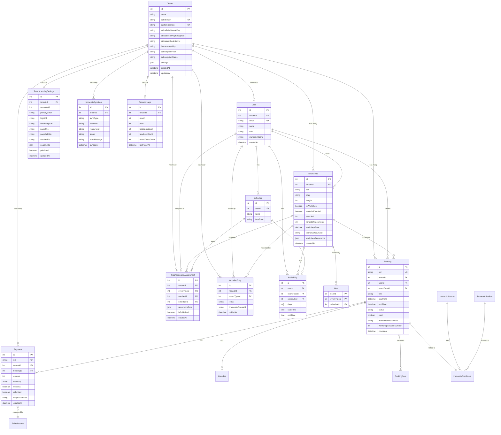

# ERD DIAGRAM - BOOKING SERVICE

## Entity Relationship Diagram



## Key Relationships

### 1. Tenant-Centric Architecture
- **Tenant** là root entity, tất cả data đều thuộc về một tenant
- Mọi bảng đều có `tenant_id` để đảm bảo data isolation

### 2. Booking Flow
- **User** (Student) tạo **Booking** cho **EventType**
- **Booking** có thể có **Payment** (nếu workshop trả phí)
- **Booking** được link với **ImmersioEnrollment** (nếu sync)

### 3. Teacher Assignment
- **TeacherCourseAssignment** kết nối **EventType** với **User** (Teacher)
- Sử dụng **Schedule** và **Availability** để xác định lịch rảnh

### 4. Whitelist System
- **WhitelistEntry** giới hạn ai có thể book **EventType**
- Có thể sync từ Immersio students

### 5. Immersio Integration
- **ImmersioSyncLog** track tất cả sync operations
- **EventType.immersioCourseId** link với Immersio course
- **Booking.immersioEnrollmentId** link với Immersio enrollment

---

## Index Strategy

### Critical Indexes

```sql
-- Multi-tenant queries (most common)
CREATE INDEX idx_booking_tenant_status_time 
  ON "Booking"(tenant_id, status, start_time);

CREATE INDEX idx_eventtype_tenant_workshop 
  ON "EventType"(tenant_id, is_workshop);

CREATE INDEX idx_user_tenant_role 
  ON "User"(tenant_id, role);

-- Whitelist lookups (performance critical)
CREATE INDEX idx_whitelist_event_email 
  ON "WhitelistEntry"(event_type_id, email);

-- Payment tracking
CREATE INDEX idx_payment_tenant_booking 
  ON "Payment"(tenant_id, booking_id, success);

-- Immersio sync
CREATE INDEX idx_synclog_tenant_status_time 
  ON "ImmersioSyncLog"(tenant_id, status, synced_at);
```

---

## Data Flow Diagrams

### Booking Creation Flow


### Immersio Sync Flow


---

**Document Version**: 1.0  
**Last Updated**: 2024-03-XX
